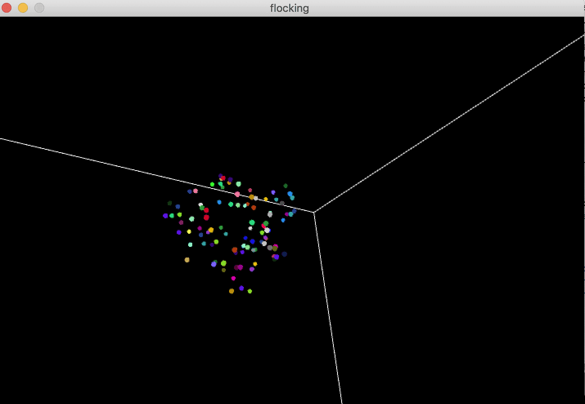

# F21GP-Processing
Assignments for the Games Programming course done in Processing 3 using Python.

1. Particle Explosion
2. Physically-driven Bouncing Ball
3. Flocking in 3D
4. A* Pathfinding - [Really good explanation.](https://www.redblobgames.com/pathfinding/a-star/introduction.html)

## Installation
Get [Processing](https://processing.org) and download these project. 
Open and run the main files (*.pyde).

## Demo
### Flocking 

#### A*
