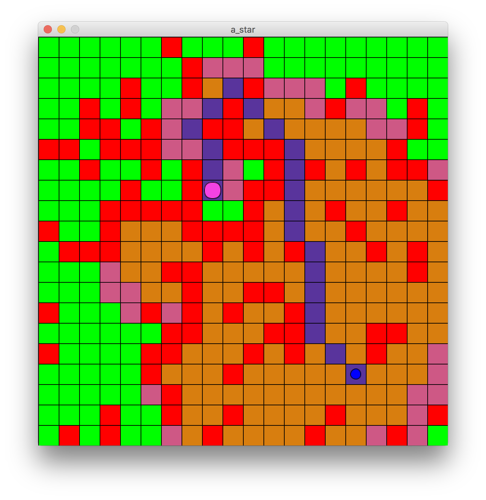

# Games Programming Report

### Vector3 Model
`Vector3` class is a model for three-dimensional (x, y, z) vectors. It then defines basic vector operation with scalers and vectors. The defined operation are: element-wise addition, subtraction, multiplication, division and scaler addition, subtraction, multiplication, division and dot, cross products. The class has two properties: `magnitude` and `direction` which get the magnitude and direction of the vector. Other functions include comparison and `strings` representation of the vector.

### Bouncing Ball
The physics is calculated in `PhysicsObject` class which uses the _suvat_ equation to calculate position, velocity, and acceleration `Vector3`s every update. The update frequency is set to match the frame rate. The `Ball` class has a `PhysicsObject` variable for keeping track of the physic properties of the ball. In the `update` function for `Ball` it calls the `PhysicsObject`'s update function first. After it has the new position, it calls `display` which draws a `Sphere` at the current position of the ball. 


### Particles System
The `ParticleEmitter` and `ParticleExplosion` classes keep track of `PhysicsParticle` objects. In every update function both the classes loop over all the particles and call their respective update functions. The `PhysicsParticle` class inherits all its physic behaviour from `PhysicsObject` class. It is updated in the same manner i.e. using _suvat_ equations. It also defines a `display` function which is called after it update the physics. The `display` function draws a low-poly sphere at the position calculated in physics update. The important distinction between `PhysicsParticle` and `Ball` is that the former has a lifetime property. After that duration the particle is removed from the particle system and no longer updated. 

In `ParticleEmitter` an emission direction vector needs to be specified, all the produced particles will have that general direction. There is a little noise added to make it appear natural. The noise if controlled by limit variables. On the other hand, `ParticleExplosion` uses the equation of a sphere to find a direction for all the generated particles. The directions are pointing from centre to surface of the sphere. To make these appear more natural, noise is added to the magnitude of these direction; otherwise it looks like an expanding sphere.

### Flocking
Flocking is accomplished by creating several instances of`Boid` class objects in the scene. Similar to other classes the object has a physics update then a draw call. The physics update is done using the `PhysicsObject` class, except for the effects of separation, cohesion, and alignment behaviours. Those effects are calculated in `Boid` class with their own function and they change the `velcotiy` property of the `PhysicsObject` component. After all the physics calculation have been complete, a sphere is draw in the `PhysicsObjects`'s current position. 

### A* Search
A* search algorithm uses the movement costs to find path to target. It uses a modified Dijkstra's algorithm. Where Dijkstra only keeps track of movement cost so far i.e. cost from start, A* also records an estimated cost to destination. To explore next move options A* finds the F-cost, i.e. sum of movement cost to start and target, of all the neighbouring nodes. It then moves to the node with lowest F-cost and repeats the process until destination has been reached. 

The algorithm is visualised below. A random maze was generated where player can go on green blocks and not on red. The starting and end points are small blue circle and large purple circle, respectively. In this search the algorithm has explored all the orange blocks to find a path. And the pink blocks are the frontier blocks i.e. the list potential blocks that can be explored next; it will select the one with lowest F-cost as mentioned. The blue blocks show the shortest path found, note that diagonal movement is allowed. The algorithm did not have to explore all the blocks on the maze to find a path. This is an advantage of using A* over other algorithms such as Breadth First Search.



Pseudo-code for A* algorithm
```python
// List of all potential nodes it can explore i.e. frontier
open_nodes = [starting_node] 
closed_nodes = [] // List of already explored nodes

loop:
    current_node = node in open_nodes with lowest f_cost
    remove current_node from open_nodes
    add current_nodes to closed_nodes
    
    if current_node == target_node:
        // Found path
        return current_node
    
    // Can be 4- or 8-connected
    foreach neighbour in neighbourhood of current_node: 
        if neighbour is blocked:    // Cannot move here
            continue
        else if neighbour is in closed_nodes:
            continue
        
        new_f_cost = calculate f_cost for neighbour
        if neighbour is not in open_nodes or \
           new_f_cost < previous f_cost of neighbour:   
           // The second condition will only happen if 
           // the node was already in open_nodes list
            set f_cost of neighbour
            set parent of neighbour to current_node
            if neighbour is not in open_nodes:
                add neighbour to open_nodes
                
// The stack of parents from target_node is the 
// shortest path to start_node
```


## Code 
### Vector3
```python
class Vector3(object):
    def __init__(self, x=0, y=0, z=0):
        self.x = x
        self.y = y
        self.z = z

    @classmethod
    def from_scaler(cls, a):
        return cls(x=a, y=a, z=a)
    
    def __add__(self, rhs):
        if isinstance(rhs, self.__class__):
            return Vector3(x=self.x + rhs.x,
                           y=self.y + rhs.y,
                           z=self.z + rhs.z)
        elif isinstance(rhs, (int, float, long)):
            return Vector3(x=self.x + rhs,
                           y=self.y + rhs,
                           z=self.z + rhs)
    __radd__ = __add__

    def __sub__(self, rhs):
        if isinstance(rhs, self.__class__):
            return Vector3(x=self.x - rhs.x,
                           y=self.y - rhs.y,
                           z=self.z - rhs.z)
        elif isinstance(rhs, (int, float, long)):
            return Vector3(x=self.x - rhs,
                           y=self.y - rhs,
                           z=self.z - rhs)

    def __mul__(self, rhs):
        if isinstance(rhs, self.__class__):
            return Vector3(x=self.x * rhs.x,
                           y=self.y * rhs.y,
                           z=self.z * rhs.z)
        elif isinstance(rhs, (int, float, long)):
            return Vector3(x=self.x * rhs,
                           y=self.y * rhs,
                           z=self.z * rhs)

    __rmul__ = __mul__
    
    def __truediv__(self, rhs):
        if isinstance(rhs, self.__class__):
            return Vector3(x=self.x / rhs.x,
                           y=self.y / rhs.y,
                           z=self.z / rhs.z)
        elif isinstance(rhs, (int, float, long)):
            return Vector3(x=self.x / rhs,
                           y=self.y / rhs,
                           z=self.z / rhs)

    def dot(self, rhs):
        return self.x * rhs.x + self.y * rhs.y + self.z * rhs.z

    def cross(self, rhs):
        return Vector3(x=self.y * rhs.z - self.z * rhs.y,
                       y=self.z * rhs.x - self.x * rhs.z,
                       z=self.x * rhs.y - self.y * rhs.x)

    def __eq__(self, rhs):
        return (self.x == rhs.x and
                self.y == rhs.y and
                self.z == rhs.z)

    def __ne__(self, rhs):
        return (self.x != rhs.x or
                self.y != rhs.y or
                self.z != rhs.z)

    def __str__(self):
        return "{}, {}, {}".format(self.x, self.y, self.z)

    @property
    def magnitude(self):
        return sqrt(self.x * self.x +
                    self.y * self.y +
                    self.z * self.z)

    @property
    def direction(self):
        mag = self.magnitude
        return Vector3(self.x / mag,
                       self.y / mag,
                       self.z / mag)

    @staticmethod
    def _test_class():
        """Simple unit tests for the class"""
        print("Running Vector3 tests")
        unit_vec = Vector3(x=1, y=1, z=1)
        print("Unit vector: {}".format(unit_vec))
        if unit_vec != unit_vec:
            print("Fail -1")
            return
        if (unit_vec == unit_vec) != True:
            print("Fail -2")
            return
        if (unit_vec + unit_vec) != (unit_vec * 2):
            print("Fail -3")
            return
        if (unit_vec - unit_vec).magnitude != 0:
            print("Fail -4")
            return
        if (unit_vec / 1) != (unit_vec / unit_vec):
            print("Fail -5")
            return
        if unit_vec.dot(unit_vec) != 3:
            print("Fail -6")
            return
        twos_vec = 1 + unit_vec
        if twos_vec != Vector3.from_scaler(2):
            print("Fail -7")
            return
        if unit_vec.cross(twos_vec) != Vector3.from_scaler(0):
            print("Fail -8")
            return
        if twos_vec.direction != unit_vec.direction:
            print("Fail -9")
            return
        print("Finished tests")
        return
```
